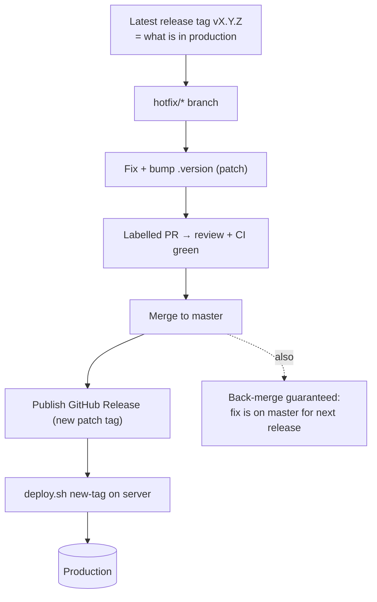

# Hotfix Runbook

A **hotfix** ships an urgent fix to production **out of band** — before the next
planned milestone release. This is the step-by-step procedure; for the wider
release model (versioning, image build, deploy mechanics) see
[RELEASING.md](./RELEASING.md).

## When to use this

- Production is broken or degraded and the fix cannot wait for the next planned
  (minor) release.
- The fix is small and targeted (a `PATCH` bump: `vX.Y.Z` → `vX.Y.(Z+1)`).

If the change can wait, prefer the normal [planned release](./RELEASING.md#planned-release-milestone-based)
flow instead.

## The golden rule

Branch from the **latest release tag**, never from `master`. `master` may contain
unreleased work that is not ready for production; branching from the live tag
keeps the hotfix limited to exactly what is already deployed plus your fix.



## Steps

The examples assume the live tag is `v3.3.1`, so the hotfix becomes `v3.3.2`.
Substitute the real current tag — check it with `git tag -l 'v*' --sort=-v:refname | head -1`.

### 1. Branch from the live release tag

```sh
git fetch --tags
git checkout -b hotfix/fix-search-index v3.3.1
```

### 2. Make the fix and bump the version

Apply the minimal change, then bump the canonical version file. Bumping
[`qgis-app/.version`](../qgis-app/.version) **is** the act of cutting the release
(the tag is always `v` + the file content).

```sh
# ... edit code ...
echo "3.3.2" > qgis-app/.version
git commit -am "Fix empty search results (shared whoosh index volume)"
```

### 3. Open a labelled PR

```sh
git push origin hotfix/fix-search-index
gh pr create --base master --label hotfix \
  --title "Fix empty search results" \
  --body "Hotfix for v3.3.2. ..."
```

- Label it `hotfix` (or `fix`) so release-drafter groups it and resolves the
  **patch** version bump.
- Wait for the `pr-test` workflow **and** the `docker.yml` build/scan to pass, and
  get at least one review. The PR targets `master`; this is also the back-merge,
  so the fix is never lost from the next planned release.

### 4. Publish the release (builds + pushes the image)

After the PR is merged, **publish a GitHub Release `v3.3.2`** targeting the merge
commit. Publishing is the single atomic event that:

- creates the `v3.3.2` git tag, and
- triggers [`docker.yml`](../.github/workflows/docker.yml) to build the `prod`
  image, run SBOM + CVE scan, and push `qgis/qgis-plugins-uwsgi:v3.3.2` (+ `latest`)
  with the scan/SBOM attached to the release.

You can do this from the draft release release-drafter maintained, or:

```sh
gh release create v3.3.2 --target master --title "v3.3.2" --generate-notes
```

### 5. Deploy to production

Once the image is pushed, on the server:

```sh
dockerize/scripts/deploy.sh v3.3.2
```

This pins `UWSGI_DOCKER_IMAGE` to `v3.3.2`, pulls the image, checks out the
matching deployment config (compose, nginx, scripts) at the tag, runs migrations,
and recreates the app services. See
[Deploying to production](./RELEASING.md#deploying-to-production).

### 6. Verify, then confirm the back-merge

- Smoke-test the specific thing you fixed in production.
- Confirm the hotfix commit is on `master` (it is, because the PR in step 3
  targeted `master`). If you ever land a hotfix by tagging a commit that is **not**
  on `master`, merge it back explicitly:

  ```sh
  git checkout master && git pull
  git merge hotfix/fix-search-index
  git push origin master
  ```

## Rollback

If the hotfix makes things worse, redeploy the previous tag — images are immutable
and pinned, so rollback is just a deploy:

```sh
dockerize/scripts/deploy.sh v3.3.1
```

`deploy.sh` prints the previous version at the end of every run for exactly this.

## Checklist

- [ ] Branched from the **latest release tag**, not `master`.
- [ ] Fix is minimal and targeted.
- [ ] `qgis-app/.version` bumped to the new patch version.
- [ ] PR labelled `hotfix`/`fix`, targets `master`, CI green, reviewed.
- [ ] GitHub Release published for the new tag (image built + pushed).
- [ ] Deployed with `deploy.sh <new-tag>` and smoke-tested in production.
- [ ] Fix confirmed on `master` (back-merge complete).
