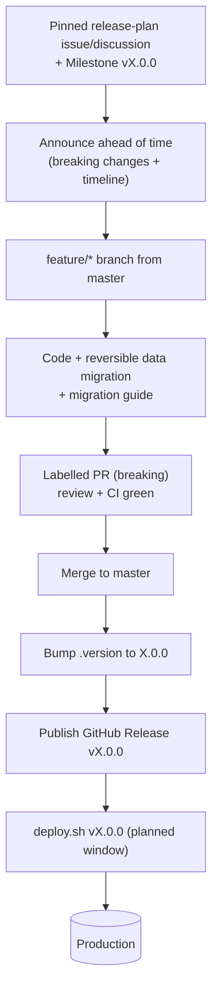

# Major Release Runbook (breaking change)

A **major release** (`vX.0.0`) ships a breaking or large change — something that is
backward-incompatible or significant enough to warrant advance announcement. It
follows the same mechanics as a [minor release](./RELEASE-MINOR.md) but adds
**communication and safety** steps because consumers (and production data) may be
affected. For the wider model see [RELEASING.md](./RELEASING.md); for labels see
[LABELS.md](./LABELS.md).

## When to use this

- The change is **backward-incompatible**: an API/URL contract change, a removed
  feature, a data-model change requiring migration, or a dependency/runtime jump
  that alters behaviour.
- A `MAJOR` bump applies: `vX.Y.Z` → `v(X+1).0.0`.

A single PR labelled `breaking` is enough to make the **whole** next release a
major one (release-drafter takes the highest bump among unreleased PRs). If your
change is additive and compatible, use the [minor flow](./RELEASE-MINOR.md).

## The model

Like a minor release, branch from **`master`**. The difference is everything
around the code: announce ahead, document the migration, and coordinate the
deploy.



## Steps

The examples assume the current release is `v3.3.2`, so the next major is `v4.0.0`.
Check the live tag with `git tag -l 'v*' --sort=-v:refname | head -1`.

### 1. Announce and plan ahead

- Open a **pinned release-plan issue or discussion** describing what breaks, why,
  who is affected, and the target timeline. This is the advance communication that
  distinguishes a major from a minor.
- Create a GitHub **Milestone** `vX.0.0` and assign the issues/PRs.

### 2. Develop with migration safety

```sh
git checkout master && git pull
git checkout -b feature/api-v2 master
# ... build the change ...
```

Because this is breaking, additionally:

- Provide a **reversible** database migration (every forward migration ships with a
  tested rollback). Never modify data outside a migration.
- Write a **migration guide** for consumers (what changed, how to adapt). Put it in
  the release notes and/or `docs/`.
- Where feasible, keep a deprecation path (warn before removing) rather than a hard
  break.

```sh
git commit -am "Add API v2 (breaking: v1 endpoints removed)"
git push origin feature/api-v2
gh pr create --base master --label breaking \
  --title "API v2 (breaking)" \
  --body "Milestone v4.0.0. Breaking: ... Migration guide: ..."
```

- Label the PR `breaking` so it lands under **Breaking changes** and resolves the
  **major** bump. See [LABELS.md](./LABELS.md).
- CI green (`pr-test` + `docker.yml`) and reviewed, then merge to `master`.

### 3. Cut the release

```sh
git checkout master && git pull
git checkout -b chore/bump-4.0.0 master
echo "4.0.0" > qgis-app/.version
git commit -am "Bump to version 4.0.0"
gh pr create --base master --label chore --title "Bump to version 4.0.0" --body "Cut v4.0.0"
# merge after CI
```

### 4. Publish the release (builds + pushes the image)

Open the draft release release-drafter prepared, confirm the **Breaking changes**
section and migration notes read correctly, target `master`, and **publish** it as
`v4.0.0`. Publishing creates the tag and triggers
[`docker.yml`](../.github/workflows/docker.yml) to build, SBOM + CVE scan, and push
`qgis/qgis-plugins-uwsgi:v4.0.0` (+ `latest`).

### 5. Deploy in a planned window

Schedule the deploy and notify stakeholders, since the change is breaking. On the
server:

```sh
dockerize/scripts/deploy.sh v4.0.0
```

This pins the image, checks out the matching deployment config at the tag, runs
migrations, and recreates the app services. See
[Deploying to production](./RELEASING.md#deploying-to-production). Have the
[rollback](#rollback) command ready before you start.

### 6. Verify and close out

- Smoke-test the breaking paths and confirm migrations applied
  (`python manage.py showmigrations`).
- Update the pinned release-plan issue with the outcome and close it.
- Close the milestone.

## Rollback

Major releases carry migration risk, so rehearse rollback first. Redeploy the
previous tag:

```sh
dockerize/scripts/deploy.sh v3.3.2
```

Images are immutable and pinned, so the **code** rolls back cleanly. If the major
release included a forward data migration, you must also run its **tested reverse
migration** — code rollback alone does not undo schema/data changes. Confirm the
reverse migration is in place before deploying the major release.

## Checklist

- [ ] Pinned release-plan issue/discussion opened and announced ahead of time.
- [ ] Milestone `vX.0.0` created and issues/PRs assigned.
- [ ] Branch cut from **`master`**; PR labelled `breaking`.
- [ ] Data migration is reversible and the reverse path is tested.
- [ ] Migration guide written for consumers.
- [ ] CI green, reviewed, merged to `master`.
- [ ] `qgis-app/.version` bumped to the new major version.
- [ ] GitHub Release published for `vX.0.0` (image built + pushed).
- [ ] Deployed in a planned window with rollback ready; smoke-tested.
- [ ] Release-plan issue and milestone closed.
