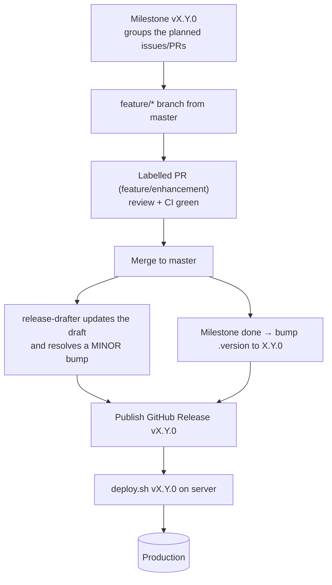

# Minor Release Runbook (enhancement / feature)

A **minor release** (`vX.Y.0`) ships planned new features and enhancements as part
of a milestone. It is the normal, scheduled path — unlike a
[hotfix](./HOTFIX.md), there is no production emergency. For the wider release
model (versioning, image build, deploy mechanics) see [RELEASING.md](./RELEASING.md),
and for what each PR label does see [LABELS.md](./LABELS.md).

## When to use this

- You are adding new user-facing capability or improving existing behaviour.
- The work is **planned** and can be grouped into a milestone.
- A `MINOR` bump applies: `vX.Y.Z` → `vX.(Y+1).0`.

If the change is an urgent production fix, use the [hotfix flow](./HOTFIX.md)
instead. If it is backward-incompatible, use the
[major release flow](./RELEASE-MAJOR.md).

## The model

Branch from **`master`** (not a release tag). `master` always represents the next
release, so planned work accumulates there until the milestone is cut. This is the
opposite of a hotfix, which branches from the live tag.



## Steps

The examples assume the current release is `v3.3.2`, so the next minor is `v3.4.0`.
Check the live tag with `git tag -l 'v*' --sort=-v:refname | head -1`.

### 1. Plan the milestone

Create a GitHub **Milestone** named for the target version (e.g. `v3.4.0`) and
assign the issues/PRs it will contain. The milestone is purely for planning and
communication — it does **not** affect the version number (that comes from
labels; see [LABELS.md](./LABELS.md)).

### 2. Develop on feature branches

```sh
git checkout master && git pull
git checkout -b feature/plugin-bulk-upload master
# ... build the feature ...
git commit -am "Add bulk plugin upload"
git push origin feature/plugin-bulk-upload
gh pr create --base master --label feature \
  --title "Add bulk plugin upload" \
  --body "Implements milestone v3.4.0 ..."
```

- Label each PR `feature` or `enhancement` so it lands under **Added** in the
  notes and resolves the **minor** bump. See [LABELS.md](./LABELS.md).
- Wait for the `pr-test` workflow and the `docker.yml` build/scan to pass, and get
  at least one review. Merge to `master`.
- As PRs merge, release-drafter keeps the single draft release updated.

### 3. Cut the release when the milestone is complete

Bump the canonical version file and merge it to `master`. Bumping
[`qgis-app/.version`](../qgis-app/.version) **is** the act of cutting the release
(the tag is always `v` + the file content).

```sh
git checkout master && git pull
git checkout -b chore/bump-3.4.0 master
echo "3.4.0" > qgis-app/.version
git commit -am "Bump to version 3.4.0"
gh pr create --base master --label chore --title "Bump to version 3.4.0" --body "Cut v3.4.0"
# merge after CI
```

### 4. Publish the release (builds + pushes the image)

Open the **draft release** release-drafter prepared, give it a final read (entries
come from your merged-PR labels/titles), set the target to `master`, and
**publish** it as `v3.4.0`. Publishing is the single atomic event that:

- creates the `v3.4.0` git tag, and
- triggers [`docker.yml`](../.github/workflows/docker.yml) to build the `prod`
  image, run SBOM + CVE scan, and push `qgis/qgis-plugins-uwsgi:v3.4.0` (+ `latest`)
  with the scan/SBOM attached to the release.

### 5. Deploy to production

Once the image is pushed, on the server:

```sh
dockerize/scripts/deploy.sh v3.4.0
```

This pins `UWSGI_DOCKER_IMAGE` to `v3.4.0`, pulls the image, checks out the
matching deployment config (compose, nginx, scripts) at the tag, runs migrations,
and recreates the app services. See
[Deploying to production](./RELEASING.md#deploying-to-production).

### 6. Verify and close out

- Smoke-test the new features in production.
- Close the milestone.

## Rollback

If the release misbehaves, redeploy the previous tag — images are immutable and
pinned, so rollback is just a deploy:

```sh
dockerize/scripts/deploy.sh v3.3.2
```

`deploy.sh` prints the previous version at the end of every run.

## Checklist

- [ ] Milestone `vX.Y.0` created and issues/PRs assigned.
- [ ] Feature branches cut from **`master`**, PRs labelled `feature`/`enhancement`.
- [ ] All PRs CI green and reviewed, merged to `master`.
- [ ] `qgis-app/.version` bumped to the new minor version on `master`.
- [ ] GitHub Release published for `vX.Y.0` (image built + pushed).
- [ ] Deployed with `deploy.sh vX.Y.0` and smoke-tested in production.
- [ ] Milestone closed.
