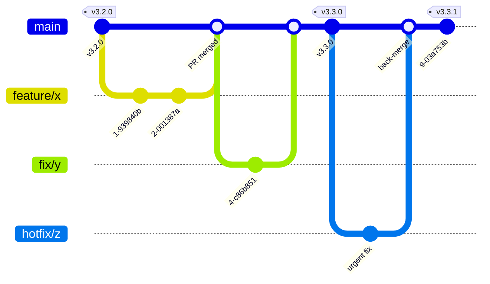
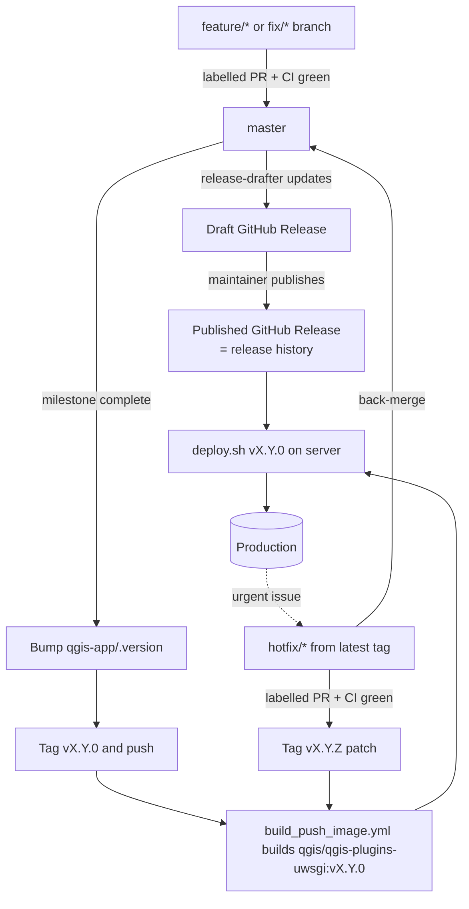

# Release & Deployment Process

This document describes how changes flow from development to production for the
QGIS Plugins Website, how we plan and communicate releases, and how to ship an
urgent hotfix without waiting for the next planned release.

## Goals

- A clean, predictable path from development to production.
- Planned releases that can be **communicated and scheduled** in advance.
- The ability to ship **urgent hotfixes immediately**, out of band.
- Reproducible, **immutable deploys** with easy rollback.

## Key concepts

### Versioning

We use [Semantic Versioning](https://semver.org/): `MAJOR.MINOR.PATCH`.

- **MAJOR** (`vX.0.0`) — breaking or large change; announced ahead of time.
- **MINOR** (`vX.Y.0`) — planned release with new features (a milestone).
- **PATCH** (`vX.Y.Z`) — hotfix / small fix shipped out of band.

The canonical version lives in [`qgis-app/.version`](../qgis-app/.version). It is
read by the `version_tag` template tag
([`qgis-app/plugins/templatetags/plugin_utils.py`](../qgis-app/plugins/templatetags/plugin_utils.py))
and shown in the site footer. **Bumping `.version` is the act of cutting a
release**, and the git tag is always `v` + the file content (e.g. `.version` =
`3.3.0` → tag `v3.3.0`). Existing tags `v1.0.0`…`v3.2.0` already follow this.

### What a tag delivers

A single tag `vX.Y.Z` defines a complete release in two parts:

| Part | Source | How it reaches production |
| --- | --- | --- |
| **Application** (`qgis-app/`, Python deps, `uwsgi.conf`) | baked into the Docker image at tag-build time (see [`Dockerfile`](../dockerize/docker/Dockerfile)) | `docker compose pull` of the pinned image |
| **Deployment config** (compose, nginx `sites-enabled/*`, scripts, Makefile) | the repo at that tag | `git checkout vX.Y.Z` on the server |

This answers the common question *"what about code outside `qgis-app/`?"* — it is
**not** in the image, but it is still versioned by the same tag and applied by
checking that tag out on the server. So nothing is left ungoverned.

> Note: `dockerize/docker/REQUIREMENTS.txt` and `dockerize/docker/uwsgi.conf` **are**
> baked into the image, so changing them produces a new image and therefore
> requires a new tag/release, just like app code.

### Immutable deploys

Production runs the application **code baked into the image**, not a bind-mounted
checkout. The base [`docker-compose.yml`](../dockerize/docker-compose.yml)
deliberately does **not** mount `../qgis-app` into the app containers; the image
referenced by `UWSGI_DOCKER_IMAGE` is the source of truth. For local development,
`docker-compose.override.yml` (copied from
[`docker-compose.override.template.yml`](../dockerize/docker-compose.override.template.yml))
re-mounts `../qgis-app` so you still get live editing.

## Branch model



- **`master`** — protected trunk. Every change lands here via PR after CI passes.
  Always represents the *next* release. Never deployed directly.
- **`feature/*`, `fix/*`** — short-lived branches → PR → `master`.
- **`hotfix/*`** — branched from the **latest release tag** (not `master`), so an
  urgent fix does not drag along unreleased work.
- There is **no long-lived production branch**. Production is simply "the tag
  currently deployed". The old `deploy-prod` branch is retired once the first
  image-based deploy succeeds.

`master` should be protected in GitHub settings: require the `pr-test` workflow to
pass and at least one review before merge.

## End-to-end flow



## Planned release (milestone-based)

1. **Plan**: create a GitHub **Milestone** named for the target version
   (e.g. `v3.3.0`) and assign the issues/PRs it will contain. This is where major
   changes are communicated and scheduled ahead of time. For a MAJOR release,
   also open a pinned "release plan" issue/discussion.
2. **Develop**: PRs merge into `master`. Label each PR (`feature`, `fix`,
   `breaking`, `chore`, …) so release notes and the version bump are derived
   automatically.
3. **Cut the release** when the milestone is done:
   1. Bump [`qgis-app/.version`](../qgis-app/.version) to the new version, commit,
      then tag and push:
      ```sh
      git tag v3.3.0
      git push origin master --tags
      ```
   2. The tag push triggers
      [`build_push_image.yml`](../.github/workflows/build_push_image.yml) →
      `qgis/qgis-plugins-uwsgi:v3.3.0` (+ `latest`).
   3. Open the **draft GitHub Release** that release-drafter prepared, give it a
      final read (the entries come from your merged-PR labels/titles), and
      **publish** it. The published release is the project's changelog — see
      [Release notes](#release-notes-changelog) below.
4. **Deploy** (see below).

## Hotfix (out of band)

Use this when production needs a fix before the next planned release.

```sh
# Branch from the live release tag, NOT master.
git checkout -b hotfix/fix-upload-crash v3.3.0
# ... make the fix, bump qgis-app/.version to 3.3.1 ...
git commit -am "Fix upload crash"
# Open a PR (label it `hotfix`/`fix`) for review + CI, then once merged/approved:
git tag v3.3.1
git push origin --tags
```

The tag builds an image just like any release; then deploy `v3.3.1`. Publish the
GitHub Release for `v3.3.1` so it appears in the release history. **Always merge
the hotfix back into `master`** so it is included in the next release.

## Deploying to production

Deploys are image-based and reproducible. On the server:

```sh
dockerize/scripts/deploy.sh v3.3.0
```

[`deploy.sh`](../dockerize/scripts/deploy.sh) will:

1. Fetch tags and check out the deployment config at `v3.3.0`.
2. Pin `UWSGI_DOCKER_IMAGE=qgis/qgis-plugins-uwsgi:v3.3.0` in `dockerize/.env`.
3. `docker compose pull` the image and recreate `uwsgi` on it.
4. Run migrations (auth first) and `collectstatic` via the existing Makefile
   targets.
5. Recreate the remaining app services (`web`, `worker`, `beat`, `dbbackups`).

### Rollback

Re-run the script with the previous version — the script prints it at the end of
every deploy:

```sh
dockerize/scripts/deploy.sh v3.2.0
```

Because images are immutable and pinned by tag, rollback is just deploying the
previous tag.

## Release notes (changelog)

There is **no `CHANGELOG.md` in the repo**. The
[GitHub Releases page](https://github.com/qgis/QGIS-Plugins-Website/releases) is
the single source of truth for the project's history — each tag has a release
with its notes.

Release notes are built from your PRs, so day to day:

- **Label your PRs** (`feature`, `enhancement`, `fix`, `bug`, `hotfix`,
  `breaking`, `chore`, `ci`, `infra`, `docs`, `dependencies`) and write a clear
  title. As PRs merge into `master`,
  [`release-drafter.yml`](../.github/release-drafter.yml) keeps a **draft
  release** updated with grouped notes. Add `skip-changelog` to omit a PR.
- Labels also decide the next version bump: `breaking` → major,
  `feature`/`enhancement` → minor, otherwise patch.
- **Unreleased changes** are visible in that draft release.
- Cutting a release = bump `qgis-app/.version`, push the tag, then **publish** the
  draft release for that tag (see [Planned release](#planned-release-milestone-based)).

## CI/CD summary

| Workflow | Trigger | Purpose |
| --- | --- | --- |
| [`test.yaml`](../.github/workflows/test.yaml) | PR/push to `master` | lint + dockerized Django tests |
| [`release-drafter.yml`](../.github/workflows/release-drafter.yml) | push to `master`, PRs | keep a draft GitHub Release updated from PR labels |
| [`build_push_image.yml`](../.github/workflows/build_push_image.yml) | git tag push | build & push `qgis/qgis-plugins-uwsgi:<tag>` (and `latest` for tags) |
