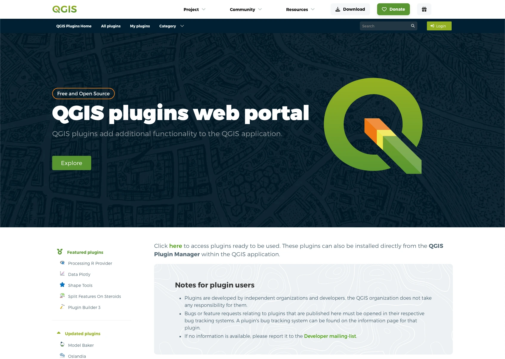
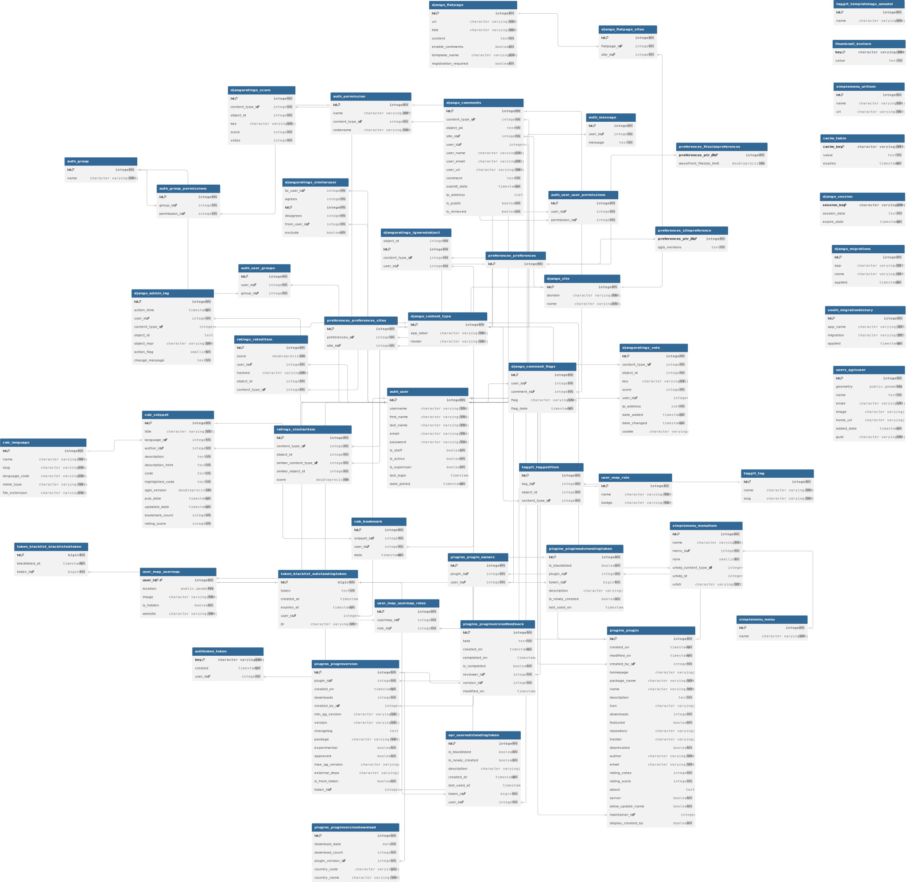

# 🌐 QGIS Plugins Website [](https://blog.qgis.org/2025/02/08/qgis-recognized-as-digital-public-good/)




> ## 👋 Welcome to plugins.qgis.org!
>
> **This repository hosts the source code for the official QGIS Plugins Repository Website:**
> 🌍 [https://plugins.qgis.org](https://plugins.qgis.org)
>
> Here you'll find everything you need to **build, develop, and contribute** to the QGIS Plugins Website.
>
> ### ⚠️ Note on Other QGIS Websites
>
> **This repository is _only_ for the main QGIS Plugins Repository Website ([plugins.qgis.org](https://plugins.qgis.org)).**
>
> If you are looking for the source code or want to contribute to other QGIS websites, please visit their respective repositories below.
> Each website has its own codebase and contribution process:
>
> - [qgis.org](https://qgis.org) ([GitHub: QGIS-Website](https://github.com/qgis/QGIS-Website)) – QGIS Main Wesite
> - [hub.qgis.org](https://hub.qgis.org) ([GitHub: QGIS-Hub-Website](https://github.com/qgis/QGIS-Hub-Website)) – QGIS Resources Hub
> - [feed.qgis.org](https://feed.qgis.org) ([GitHub: qgis-feed](https://github.com/qgis/qgis-feed)) – QGIS Feed Manager
> - [planet.qgis.org](https://planet.qgis.org) ([GitHub: QGIS-Planet-Website](https://github.com/qgis/QGIS-Planet-Website)) – QGIS Planet Blog Aggregator
> - [members.qgis.org](https://members.qgis.org) ([GitHub: QGIS-Members-Website](https://github.com/qgis/QGIS-Members-Website)) – QGIS Sustaining Members Portal
> - [certification.qgis.org](https://certification.qgis.org) ([GitHub: QGIS-Certification-Website](https://github.com/qgis/QGIS-Certification-Website)) – QGIS Certification Programme Platform
> - [changelog.qgis.org](https://changelog.qgis.org) ([GitHub: QGIS-Changelog-Website](https://github.com/qgis/QGIS-Changelog-Website)) – QGIS Changelog Manager
> - [uc2025.qgis.org](https://uc.qgis.org) ([GitHub: QGIS-UC-Website](https://github.com/qgis/QGIS-UC-Website)) – QGIS User Conference Website
>
> For issues related to specific plugins or other concerns, please use their respective bug tracker (see the metadata/details of the concerned plugin).


<!-- TABLE OF CONTENTS -->
<h2 id="table-of-contents"> 📖 Table of Contents</h2>

<details open="open">
  <summary>Table of Contents</summary>
  <ol>
    <li><a href="#-project-overview"> 🚀 Project Overview </a></li>
    <li><a href="#-qa-status"> 🚥 QA Status </a></li>
    <li><a href="#-license"> 📜 License </a></li>
    <li><a href="#-folder-structure"> 📂 Folder Structure </a></li>
    <li><a href="#-using-ai-large-language-models"> 🤖 Using 'AI' (Large Language Models) </a></li>
    <li><a href="#️-tech-stack"> 🛠️ Tech Stack </a></li>
    <li><a href="#️-data-model"> 🗄️ Data Model </a></li>
    <li><a href="#-token-based-authentication"> 🔑 Token-based Authentication </a></li>
    <li><a href="#-using-the-nix-shell"> 🧊 Using the Nix Shell </a></li>
    <li><a href="#-contributing"> ✨ Contributing </a></li>
    <li><a href="#-have-questions"> 🙋 Have Questions? </a></li>
    <li><a href="#-contributors"> 🧑‍💻👩‍💻 Contributors </a></li>
  </ol>
</details>


## 🚀 Project Overview


## 🚥 QA Status

### 🪪 Badges
| Badge | Description |
|-------|-------------|
| [](https://github.com/qgis/QGIS-Plugins-Website/actions/workflows/test.yaml) | Lint and Django Unit Tests |
| [](https://github.com/qgis/QGIS-Plugins-Website/actions/workflows/build_push_image.yml) | Build and Push Docker Image to DockerHub |
|  | Website availability status |
|  | Repository license |
|  | Open issues count |
|  | Closed issues count |
|  | Open pull requests count |
|  | Closed pull requests count |

### ⭐️ Project Stars


## 📜 License

This project is licensed under the GPL-2.0 License. See the [COPYING](./COPYING) file for details.


## 📂 Folder Structure

```plaintext
QGIS-Plugins-Website/
├── 🐳 dockerize/               # Docker-related setup and configuration
├── 🖼️ img/                     # Images and media assets for this README
├── 🤖 playwright/              # End-to-end tests using Playwright
├── 🛰️ qgis-app/                # Main Django application source code
├── 🗝️ auth.json                # Authentication credentials for the Playwright test
├── 🧪 codecov.yml              # Codecov configuration for test coverage reporting
├── 📜 COPYING                  # Project license file (GPL-2.0)
├── 📘 CONTRIBUTING.md          # Contribution guidelines
├── 📝 list-vscode-extensions.sh* # Script to list recommended VSCode extensions for Nix shell environment
├── 📖 README.md                # Project overview and documentation (this file)
├── 📦 REQUIREMENTS-dev.txt     # Python dependencies for development
├── ⚙️ setup.cfg                # Flake8 configuration file
├── 🧊 shell.nix                # Nix shell environment definition
└── 🖥️ vscode.sh*                # VSCode helper script for Nix shell environment
```


## 🤖 Using 'AI' (Large Language Models)

We are fine with using LLM's and Generative Machine Learning to act as general assistants, but the following three guidelines should be followed:

1. **Repeatability:** Although we understand that repeatability is not possible generally, whenever you are verbatim using LLM or Generative Machine Learning outputs in this project, you **must** also provide the prompt that you used to generate the resource.
2. **Declaration:** Sharing the prompt above is implicit declaration that a machine learning assistant was used. If it is not obvious that a piece of work was generated, include the robot (🤖) icon next to a code snippet or text snippet.
3. **Validation:** Outputs generated by a virtual assistant should always be validated by a human and you, as contributor, take ultimate responsibility for the correct functionality of any code and the correct expression in any text or media you submit to this project.


## 🛠️ Tech Stack


This application is based on Django, written in Python and deployed on the server using
docker-compose.


## 🗄️ Data Model

Below is the Entity-Relationship Diagram (ERD) illustrating the core data model for the QGIS Plugins Website.
For a detailed view, click on the image below or see the full-size diagram in [erd.svg](./img/erd.svg):

[](./img/erd.svg)


## 🔑 Token-based Authentication

Users can generate a Simple JWT token by providing their credentials, which can then be utilized to access endpoints requiring authentication.
Users can create specific tokens for a plugin at `https://plugins.qgis.org/<package_name>/tokens/`.


```sh
# A specific plugin token can be used to upload or update a plugin version. For example:
curl \
  -H "Authorization: Bearer the_access_token" \
  https://plugins.qgis.org/plugins/api/<package_name>/version/add/

curl \
  -H "Authorization: Bearer the_access_token" \
  https://plugins.qgis.org/plugins/api/<package_name>/version/<version>/update
```


## 🧊 Using the Nix Shell

Please refer to the [Nix section](./CONTRIBUTING.md#nix) in [CONTRIBUTING.md](./CONTRIBUTING.md).


## ✨ Contributing

We welcome contributions! Please read the [CONTRIBUTING.md](CONTRIBUTING.md) for guidelines on how to get started.


## 🙋 Have Questions?

Have questions or feedback? Feel free to open an issue or submit a Pull Request!


## 🧑‍💻👩‍💻 Contributors

- [Tim Sutton](https://github.com/timlinux) – Original author and lead maintainer of the QGIS Plugins Website project
- [Kontur Team](https://www.kontur.io) – Responsible for the design of the current theme
- [Lova Andriarimalala](https://github.com/Xpirix) – Core developer and ongoing maintainer
- [QGIS Contributors](https://github.com/qgis/QGIS-Plugins-Website/graphs/contributors) – See the full list of amazing contributors who have helped make this website possible.


Made with ❤️ by Tim Sutton (@timlinux), Lova Andriarimalala (@Xpirix) and QGIS Contributors.
